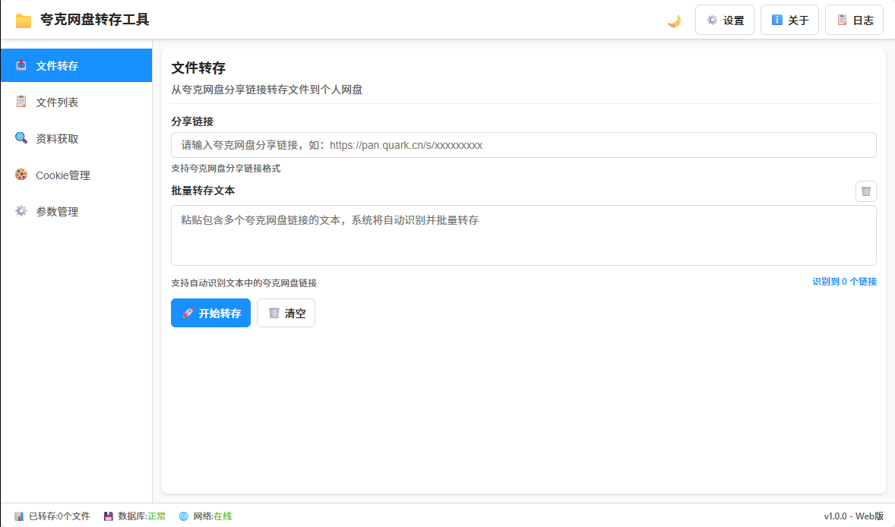

# 夸克网盘转存工具 - Web版


基于纯Web技术的夸克网盘文件转存工具，无需安装任何运行环境，直接在浏览器中使用。


## ✨ 特性

- 🚀 **文件转存**: 支持单个和批量转存夸克网盘分享链接
- 🔍 **智能检测**: 自动检测重复文件，避免重复转存  
- 📊 **实时进度**: 5步骤进度显示，实时了解转存状态
- 💾 **本地存储**: 使用IndexedDB本地存储，数据安全可靠
- 📱 **响应式设计**: 完美适配桌面端、平板和移动设备
- 🎨 **主题支持**: 内置亮色/暗色主题切换
- 🔧 **零配置**: 开箱即用，只需配置Cookie即可使用

## 🚀 快速开始

### 1. 下载项目


### 2. 启动代理服务器（解决CORS问题）

```bash
# 直接运行
node proxy-server.js

# 或使用部署脚本
chmod +x deploy-proxy.sh && ./deploy-proxy.sh
```

### 4. 配置Cookie

1. 登录夸克网盘网页版
2. 打开浏览器开发者工具（F12）
3. 在Network标签页中复制任意请求的Cookie值
4. 在应用设置页面粘贴Cookie并测试连接

## 📁 项目结构

```
Quark-GUI/
├── index.html              # 主页面
├── css/                    # 样式文件
├── js/                     # JavaScript模块
│   ├── main.js            # 主控制器
│   ├── services/          # 服务层（API、数据库）
│   ├── components/        # 组件层（转存、文件列表、设置）
│   └── utils/             # 工具函数
├── proxy-server.js        # CORS代理服务器
└── deploy-proxy.sh        # 部署脚本
```

## 🔧 功能说明

### 文件转存

- 单个/批量夸克网盘链接转存
- 自动重复文件检测
- 实时转存进度显示

### 文件管理  

- 查看所有转存记录
- 搜索和过滤功能
- 数据导入导出

### 资料搜索

- 多平台网盘资源搜索
- 一键转存搜索结果

## 🌐 部署方案

### 本地使用

```bash
node proxy-server.js
```

### 服务器部署

1. 上传所有文件到服务器
2. 运行代理服务器：`node proxy-server.js`
3. 配置域名访问（可选）


## ❓ 常见问题

**Q: 转存失败，提示CORS错误**  
A: 确保代理服务器正常运行，检查8081端口是否可访问

**Q: Cookie测试失败**  
A: 检查Cookie是否过期，重新获取最新Cookie

**Q: 移动端显示异常**  
A: 清除浏览器缓存并刷新页面

## 🛠️ 技术栈

- **前端**: HTML5 + CSS3 + JavaScript ES6+
- **存储**: IndexedDB
- **网络**: Fetch API
- **架构**: 模块化 + 组件化

## 📄 许可证

MIT License - 查看 [LICENSE](LICENSE) 文件了解详情

## 🤝 贡献

欢迎提交Issue和Pull Request！

1. Fork本项目
2. 创建特性分支
3. 提交更改
4. 发起Pull Request

## 📞 支持

如果遇到问题，请：

- 提交 [Issue](https://github.com/your-username/Quark-GUI/issues)
- 查看 [Wiki](https://github.com/your-username/Quark-GUI/wiki)

---

⭐ 如果这个项目对您有帮助，请给它一个Star！
